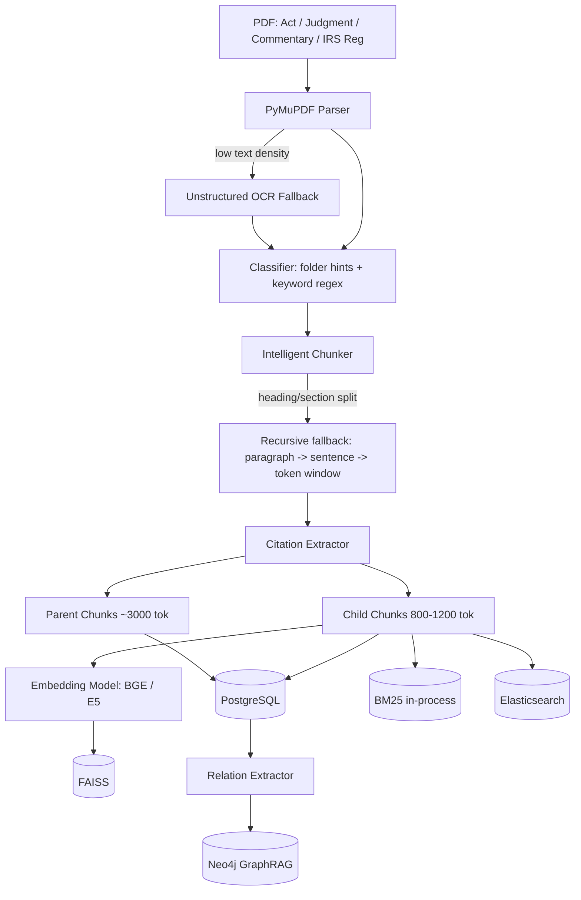
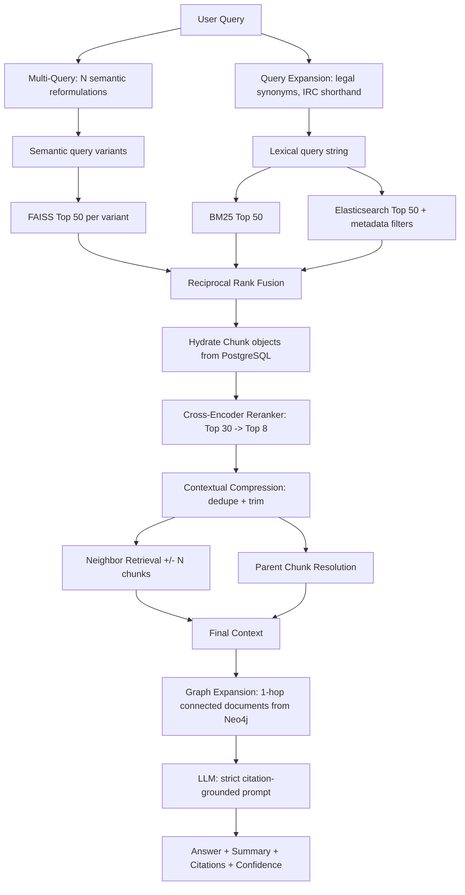
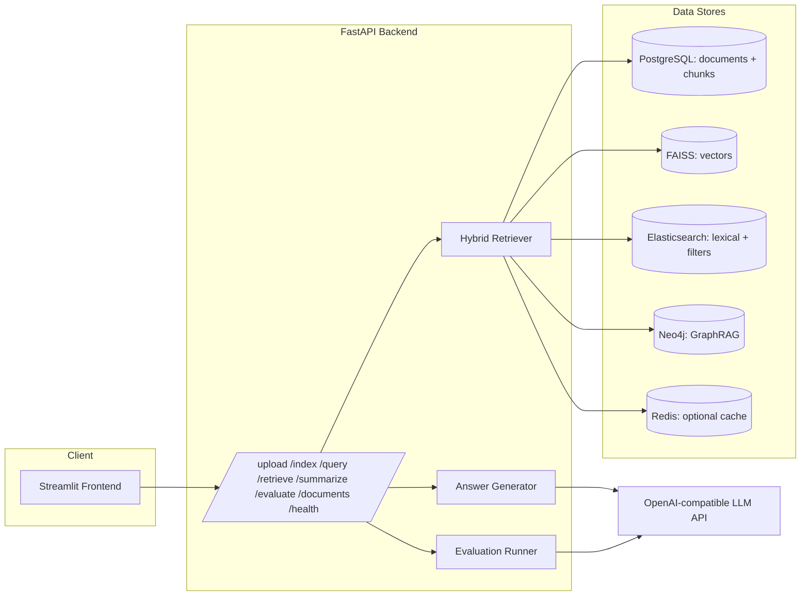

# Architecture Diagrams

## 1. Ingestion Pipeline

```mermaid
flowchart TD
    A[PDF: Act / Judgment / Commentary / IRS Reg] --> B[PyMuPDF Parser]
    B -->|low text density| B2[Unstructured OCR Fallback]
    B --> C[Classifier: folder hints + keyword regex]
    B2 --> C
    C --> D[Intelligent Chunker]
    D -->|heading/section split| D1[Recursive fallback: paragraph -> sentence -> token window]
    D1 --> E[Citation Extractor]
    E --> F[Child Chunks 800-1200 tok]
    E --> G[Parent Chunks ~3000 tok]
    F --> H[(PostgreSQL)]
    G --> H
    F --> I[Embedding Model: BGE / E5]
    I --> J[(FAISS)]
    F --> K[(BM25 in-process)]
    F --> L[(Elasticsearch)]
    H --> M[Relation Extractor]
    M --> N[(Neo4j GraphRAG)]
```

## 2. Hybrid Retrieval Pipeline

```mermaid
flowchart TD
    Q[User Query] --> QE[Query Expansion: legal synonyms, IRC shorthand]
    Q --> MQ[Multi-Query: N semantic reformulations]
    QE --> LEX[Lexical query string]
    MQ --> SEM[Semantic query variants]

    SEM --> FAISS[FAISS Top 50 per variant]
    LEX --> BM25[BM25 Top 50]
    LEX --> ES[Elasticsearch Top 50 + metadata filters]

    FAISS --> RRF[Reciprocal Rank Fusion]
    BM25 --> RRF
    ES --> RRF

    RRF --> HYD[Hydrate Chunk objects from PostgreSQL]
    HYD --> CE[Cross-Encoder Reranker: Top 30 -> Top 8]
    CE --> CC[Contextual Compression: dedupe + trim]
    CC --> NB[Neighbor Retrieval +/- N chunks]
    CC --> PC[Parent Chunk Resolution]
    NB --> CTX[Final Context]
    PC --> CTX
    CTX --> GR[Graph Expansion: 1-hop connected documents from Neo4j]
    GR --> LLM[LLM: strict citation-grounded prompt]
    LLM --> ANS[Answer + Summary + Citations + Confidence]
```

## 3. System Architecture (Deployment)

```mermaid
flowchart LR
    subgraph Client
        UI[Streamlit Frontend]
    end

    subgraph Backend[FastAPI Backend]
        API[/upload /index /query /retrieve /summarize /evaluate /documents /health/]
        RET[Hybrid Retriever]
        GEN[Answer Generator]
        EVAL[Evaluation Runner]
    end

    subgraph Stores[Data Stores]
        PG[(PostgreSQL: documents + chunks)]
        FA[(FAISS: vectors)]
        ES[(Elasticsearch: lexical + filters)]
        NEO[(Neo4j: GraphRAG)]
        RD[(Redis: optional cache)]
    end

    LLMAPI[OpenAI-compatible LLM API]

    UI --> API
    API --> RET
    RET --> PG
    RET --> FA
    RET --> ES
    RET --> NEO
    API --> GEN
    GEN --> LLMAPI
    API --> EVAL
    EVAL --> LLMAPI
    RET --> RD
```
